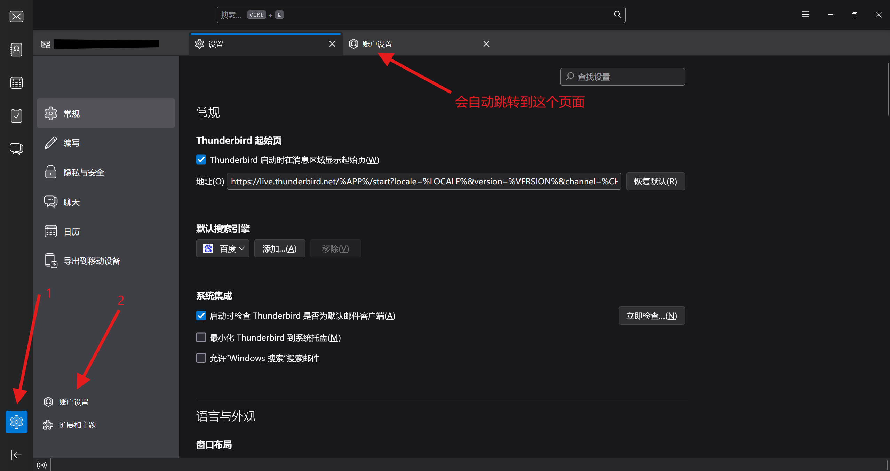

# How to use OpenPGP
### 目录  

1. [准备工具](#准备工具)  
2. [开始操作](#开始操作)  
2.1. [下载、安装软件](#1.下载、安装软件)  
2.2. [登录](#2.登录)  

## 准备工具  
硬件：  
一个有基本搜索能力的双手和有一定理解能力的脑子；一台能接入互联网的电脑（或手机，etc.）  

软件：  
电脑端：Thunderbird；  
手机端：Thunderbird Mobile（或K-9 Mail，其他支持的也可）、OpenKeychain~~这是我们待会要用到的神奇喵喵工具~~  

另外还需要一个电子邮箱和对应的~~能收邮件~~的电子邮箱软件  

>[!NOTE]
>对于Gmail，需要在合适的网络环境下设置，并需要安装Chrome浏览器。  
>对于Outlook，Thunderbird(Mobile)/K-9 Mail获取到的服务器配置不正确，需要手动修改。服务器设置见[此处](https://support.microsoft.com/zh-cn/office/outlook-com-%E7%9A%84-pop-imap-%E5%92%8C-smtp-%E8%AE%BE%E7%BD%AE-d088b986-291d-42b8-9564-9c414e2aa040)  
>QQ邮箱的设置非常麻烦，故不建议使用QQ邮箱。~~有条件的可以百度QQ邮箱开启IMAP方法~~  

>[!WARNING]  
>作者不对一切误操作（手抽删掉私钥等操作）负任何责任。  
>数据无价，进行任何操作前请谨慎。  

## 开始操作  
### 1.下载、安装软件  
这没啥好说的。一直下一步就行，该给的权限全都给上。  
[Thunderbird和Thunderbird Mobile的下载链接](https://www.thunderbird.net/zh-CN/thunderbird/all/)  

K-9 Mail现在已经“成为Mozilla大家族中的一员了”，所以下载要到Thunderbird-Android的[Release](https://github.com/thunderbird/thunderbird-android/releases)里下载。最新的K-9 Mail Release见[此处](https://github.com/thunderbird/thunderbird-android/releases/tag/K9MAIL_8_2)。  

### 2.登录  

>[!NOTE]  
>下文将以电脑端、Gmail为例，请检查网络环境。  

打开电脑端Thunderbird，左下角打开设置，点击“设置”页面左下角的“账户设置”。  

  

在新的页面里点击“账户操作”，之后点击“添加邮件账户...(A)”  

  

在“您的全名”处填一个想让收件人看到的~~正常的~~名字，“电子邮件地址”填你自己的邮箱，“密码”直接写你登录Google时输入的密码~~忘了密码就当我没说，直接空着好像也可以直接下一步~~  

  

点击“继续”，等待软件自动查询邮件服务器配置。一段时间后提示“从Mozilla ISP数据库中找到配置”，检查无误后即可进行下一步。  

     

>[!WARNING]
>下面的那个Tip不保证一定可信，请结合实际情况决定。

>[!TIP]  
>Outlook用户需要修改服务器配置。  
在图三所示页面中，输入完基本信息并( _可能需要输入密码，请自行手动确认_ )点击左下角“手动配置”后，将会弹出如下图所示的服务器配置。请参照下面的链接对服务器设置进行调整，用户名保持不变。请确保IMAP/SMTP服务器的验证方式都是OAuth2。  
不过似乎OAuth2验证方式不会主动冒出来，所以**请在点击“继续”之后**再点击左下角的“手动配置”。  
服务器配置见[此处](https://support.microsoft.com/zh-cn/office/outlook-com-%E7%9A%84-pop-imap-%E5%92%8C-smtp-%E8%AE%BE%E7%BD%AE-d088b986-291d-42b8-9564-9c414e2aa040)。  

点击“完成”，会弹出一个浏览器窗口。请在该窗口内进行Gmail的登录和授权操作，**这样做是安全的**。  

~~请坐和放宽~~  

到此处，你就成功完成了Gmail的登录操作。（🌫）  

  

